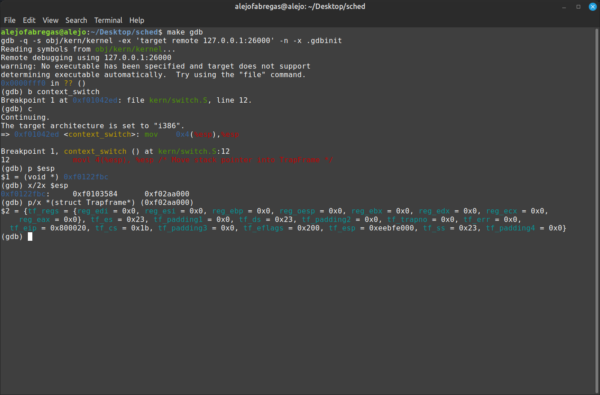
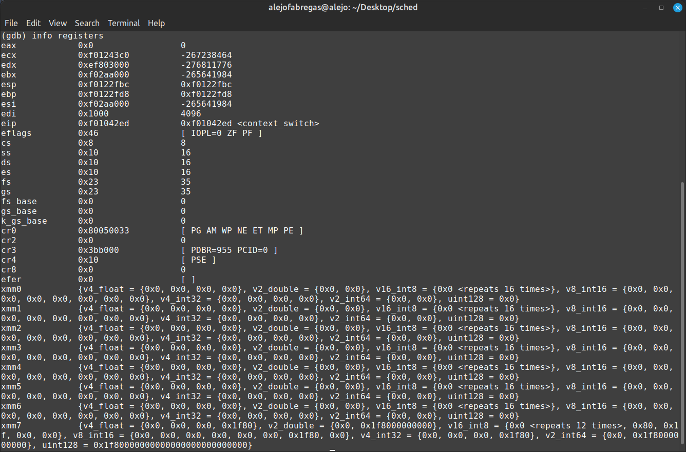
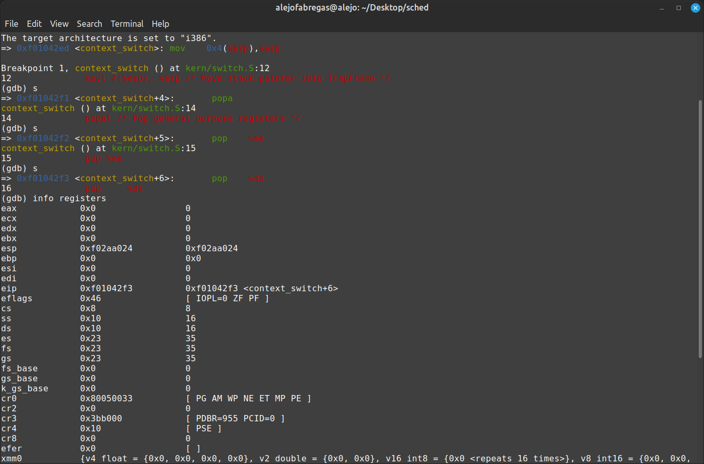
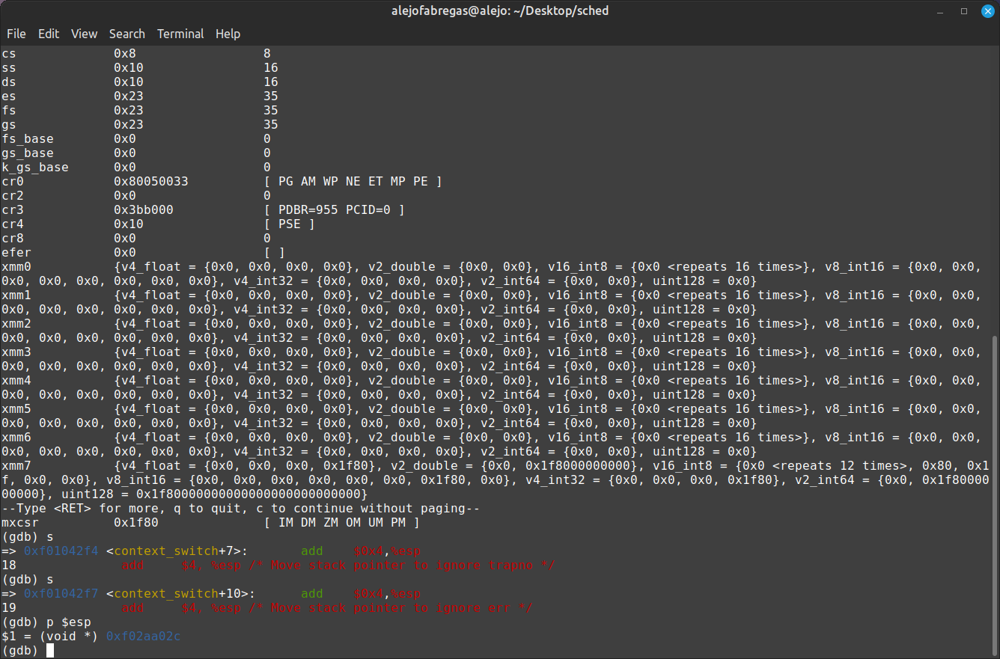
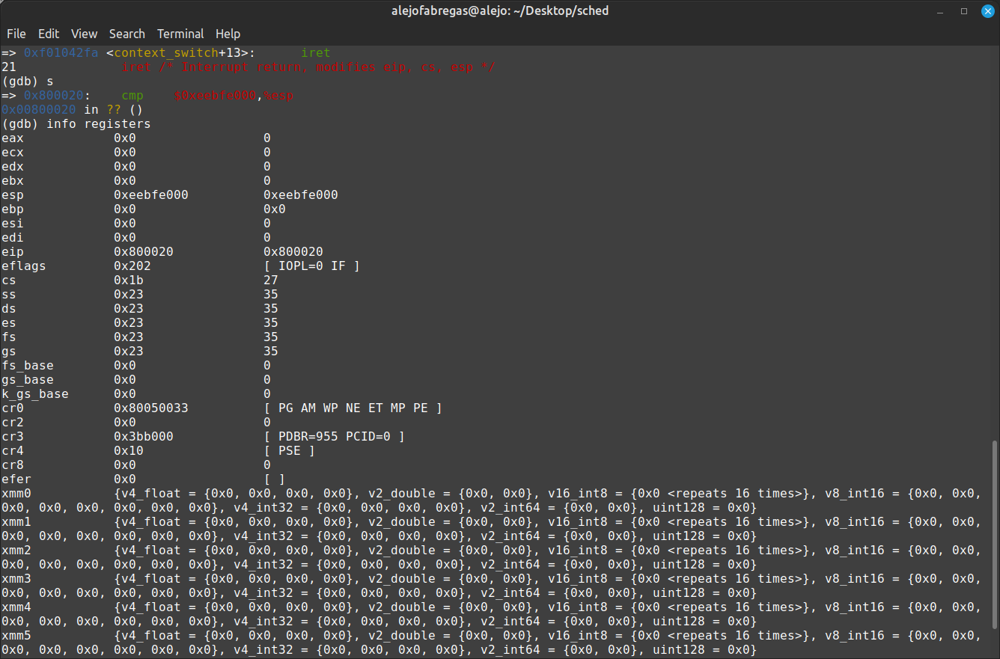

# sched

### Ejecución con distintos schedulers
Round Robin:
```bash
make qemu USE_RR=true
```
Lottery Scheduler:
```bash
make qemu USE_LOTT=true
```

### Ejecución de test usando Docker
```bash
docker build -t fisop:18.04 .
```
```bash
docker run -it --rm --name=lab-sched fisop:18.04 bash
```

## Cambio de contexto

A continuación se adjuntan algunas capturas de pantalla para ver cómo funciona el cambio de contexto en nuestro kernel.
Las imágenes son de una sesión de GDB en nuestro kernel con un breakpoint en la función context_switch.

Imagen 1: estado del trapframe al inicio del context switch:

Se mueve el stack pointer que apunta al Trapframe, que contiene los datos iniciales como la dirección del stack pointer de usuario (tf_esp) o el instruction pointer al código de usuario (tf_eip).


Imagen 2: estado de los registros al inicio del context_switch:

Se ve que estamos en modo kernel por el $cs en 0x8, el instruction pointer que está muy alto ($eip = 0xf01042ed) y el stack pointer que apunta al stack del kernel (%esp = 0xf0122fbc).


Imagen 3: estado de los registros luego de actualizarlos con el TrapFrame:

Luego de hacer el popal de los registros de propósito general y el pop de $es y $ds desde el TrapFrame, se ve como cambian los valores de estos registros (ver $es), pero seguimos en modo kernel.


Imagen 4: estado del stack pointer luego de moverlo para ignorar trapno y err del TrapFrame:

Se ve que se modifica el valor del $esp luego de moverlo dos veces para ignorar a los valores trapno y err del TrapFrame.


Imagen 5: estado de los registros luego de la ejecución de iret, finaliza el context switch:

Se ve que pasamos a user mode, ya que cambia el registro $cs = 0x1b, el stack pointer apunta al stack del usuario ($esp = 0xeebfe000), y el instruction pointer apunta al código del usuario ($eip = 0x800020).


## Scheduler con prioridades

Para la parte 3 del trabajo práctico decidimos implementar un `lottery scheduler` por varias razones.
La primera es que es un scheduler fácil de implementar, por lo menos comparado con otros schedulers con prioridad como MLFQ.
La segunda es que para ser simple funciona bastante bien por el hecho que usa aleatoriedad o randomness (es bastante "justo" o "fair").
La tercera es que es un scheduler que no vimos en las clases teóricas a diferencia de MLFQ y otros, por lo que haciendo el TP aprendimos sobre otro tipo de scheduler.

La política de scheduling es bastante simple. Todos los procesos tienen un número de `tickets` que equivale a su `prioridad`. Al tener más tickets significa que un proceso tiene más chances de usar la CPU.

Se hace un sorteo con un número pseudo-aleatorio, y aquel proceso que gane el sorteo va a utilizar a la CPU por un cierto time slice.
Decidimos no tener un número fijo de tickets, sino que sea variable. Cuando se crea un proceso, cada uno recibe `25` tickets.
Cuando un proceso gana el sorteo y es elegido para ser ejecutado, se le resta su prioridad en `1` ticket, para que el resto de los procesos que no fueran ejecutados tengan más chance de ejecutarse.

Para la syscall fork, decidimos que los procesos hijos hereden la cantidad de tickets de su proceso padre, ya que creemos que es justo que tengan la misma prioridad, y no se puedan utilizar a los procesos hijos para aumentar la prioridad de un proceso e intentar utilizar a la CPU más frecuentemente.

Cada una cierta cantidad de llamados al scheduler decidimos hacer un `boosting`: se sube la prioridad de todos los procesos para evitar que aquellos que tengan una prioridad muy baja queden relegados para siempre, evita la degradación del scheduler.

El objetivo de este scheduler es que sea justo y que todos los procesos tengan la chance de ejecutarse. Aquellos que ya se ejecutaron bastante se les baja la prioridad para que aquellos que no se ejecutaron tengan más chances de hacerlo.


## Estadísticas
Las estadísticas agregadas en la estructura Env son utilizadas para recopilar información sobre el comportamiento y 
rendimiento de los entornos (procesos) en el sistema. Estas estadísticas se actualizan y registran durante la ejecución 
de los entornos y pueden ser utilizadas para analizar y monitorear el rendimiento del sistema.

```
struct Env {
	struct Trapframe env_tf;  // Saved registers
	struct Env *env_link;     // Next free Env
	envid_t env_id;           // Unique environment identifier
	envid_t env_parent_id;    // env_id of this env's parent
	enum EnvType env_type;    // Indicates special system environments
	unsigned env_status;      // Status of the environment
	uint32_t env_runs;        // Number of times environment has run
	int env_cpunum;           // The CPU that the env is running on

#ifdef LOTTERY
	uint32_t env_tickets;  // Number of tickets (priority)
    // New fields for statistics
    int execution_count;
    unsigned start_time;
#endif
```

Las estadísticas agregadas en esta estructura son las siguientes:

- **execution_count**: Esta variable registra el número de veces que un entorno ha sido ejecutado. Cada vez que se asigna 
    tiempo de CPU a un entorno y se ejecuta su código, se incrementa el valor de esta variable. Proporciona información sobre la cantidad de 
    tiempo de CPU utilizado por un entorno en particular.

- **start_time**: Esta variable almacena el tiempo de inicio (timestamp) en el 
que un entorno se inició por última vez. Se utiliza para registrar el momento en 
el que se inicia la ejecución de un entorno y puede ser útil para realizar mediciones de tiempo y 
calcular el tiempo transcurrido desde el inicio de un entorno.

Tambien se agrego una lista de ejecuciones para contener la información de que proceso se fue ejecutando
cada vez que se llamo al scheduler.
```
#define MAX_HISTORY_OF_EXECUTIONS 1000
envid_t history_of_executions[MAX_HISTORY_OF_EXECUTIONS];
int history_of_executions_counter = 0;
```

## Descripción de la Prueba

El código proporcionado representa una prueba que implica la creación de dos procesos con diferentes prioridades, 
lo que nos permite observar los efectos de la planificación por prioridades. El propósito de esta prueba es demostrar el impacto de la prioridad en el comportamiento de planificación de los procesos.

### Ejecucion de la prueba
```
make qemu -B USE_LOTT=true
```

## Implementación de la Prueba
```
#include <inc/lib.h>

#define NUM_ITERATIONS 10

void tickets_process(void)
{
    int i, j;
    envid_t env_id = sys_getenvid();

    // Print the environment ID
    cprintf("Tickets Process (ID: %08x) starting...\n", env_id);

    // Perform a series of computations
    for (i = 0; i < NUM_ITERATIONS; i++) {
        for (j = 0; j < 10000000; j++) {
            // Perform some dummy computations
            int temp = (j + 1) * (i + 1);
            temp = temp / (j + 1);
        }
    }

    // Print a message to indicate the end of the process
    cprintf("Tickets Process (ID: %08x) completed!\n", env_id);
}


void
umain(int argc, char **argv)
{
    envid_t ticket_process_1, ticket_process_2;

    // Fork the high tickets process
    ticket_process_1 = fork();
    if (ticket_process_1 < 0)
        panic("umain: fork for first tickets process failed");

    if (ticket_process_1 == 0) {
        tickets_process();
        return;
    }

    // Fork the low tickets process
    ticket_process_2 = fork();
    if (ticket_process_2 < 0)
        panic("umain: fork for second tickets process failed");

    if (ticket_process_2 == 0) {
        tickets_process();
        return;
    }

    // Wait for both processes to complete
    // Wait for the first to finish forking
    while (envs[ENVX(ticket_process_1)].env_status != ENV_FREE)
        asm volatile("pause");
    // Wait for the second to finish forking
    while (envs[ENVX(ticket_process_2)].env_status != ENV_FREE)
        asm volatile("pause");

    // Print a message to indicate the end of the program
    cprintf("Process completed!\n");
}

```

El código inicializa una variable entera volátil llamada counter y define una función llamada tickets_process. La función 
tickets_process realiza una serie de cálculos ficticios dentro de bucles anidados. Estos cálculos simulan tareas intensivas 
en la CPU. Después de completar los cálculos, la función imprime un mensaje que indica la finalización del proceso.

En la función umain, se crean dos procesos utilizando la llamada al sistema fork.  
Ambos procesos ejecutan la función tickets_process. El propósito de crear dos procesos es observar el 
comportamiento de la planificación y determinar si el proceso de mayor prioridad se ejecuta con mayor frecuencia.

La función umain espera a que ambos procesos terminen utilizando el mecanismo de espera.